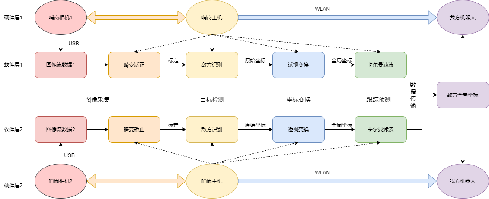

# TARS_GO-哨岗视觉定位算法

```
ICRA2020-JLU-TARS_GO-Perception/
├── README.md                            #说明文档
├── test_video.mp4                       #测试流程视频
├── function.h                           #哨岗功能头文件（实战）
├── main.cpp                             #主函数（实战）
├── test.cpp                             #测试函数
├── pics                                 #图片文件
│   ├── set_location_points.jpg          #标定示例
│   ├── test_image.jpg                   #标定示例
│   ├── robort_detection.png             #机器人识别示例
│   ├── KalmanFilter_test.jpg            #卡尔曼滤波效果图
│   ├── software_framework.png           #软件框架图
│   ├── test_result.jpg                  #测试效果图
```


## 依赖工具

基于C++语言，利用Opencv实现哨岗相机对敌方机器人的识别、跟踪与全局定位，通过WLAN实现与机器人的通讯；

程序依赖工具如下：

* Flycapture2(仅实战使用)
* opencv==3.4.6


## 内容简述

本程序利用场地对角两台哨岗摄像头对全局进行实时图像采集与敌我识别，通过透视变换计算并向我方机器人传输敌人在全局场地下的二维坐标位置。本程序主要包含以下五个功能模块：

- 红色车、蓝色车灯条检测模块（余弦相似度）

- 敌我全局定位模块（透视变换）

- 双哨岗误差校正模块（相互矫正区域取平均值）

- 基于卡尔曼滤波车辆位置跟踪模块

- 哨岗与机器人之间的通讯传输（WLAN）

  

  软件架构如下图所示

  

  


各模块简要介绍如下（本算法理论基础及感知部分算法介绍可见项目wiki）：

### 红色车、蓝色车灯条检测模块

* 通过RGB范围提取，以余弦相似度辅助，精准筛选红色、蓝色灯条

### 敌我全局定位模块

* 对相同颜色的灯条，以灯条中心之间的间距大小为条件，对所有同色灯条进行聚类，分别得到场上A/B两辆车的灯条集合
* 对同一集合中所有的灯条坐标求平均，即为哨岗视角下的整车坐标，同一视角下有我方A/B车坐标以及敌方A/B车坐标

* 使用灯条聚类求平均作为整车坐标的原因：
  * 在原始图像尺寸1024x1024的情况下，机器人在视野中所占比例较小，装甲板或整车识别的限制条件过多，精度低、速率慢，不适合哨岗使用
  * 采用灯条识别、距离聚类实现简单，代码执行效率高，且对于机器人部分遮挡情况下依然能够保持识别准确率，符合哨岗工作要求

* 通过张正有标定法，标定哨岗相机，得到哨岗相机内参，矫正相机镜头的畸变
* 利用哨岗视角下的边缘四点标定，与全局地图的边缘四点，可算得透视变换矩阵Mask
  
* 将我方A/B车坐标以及敌方A/B车坐标与Mask相乘，得到全局地图下的敌我机器人坐标

### 双哨岗误差校正模块

* 由于哨岗相机检测范围有限，且检测误差与机器人和哨岗相机之间的距离正相关，故需要对双哨岗相机的检测结果进行算术平均，从而减小坐标误差

### 基于卡尔曼滤波车辆位置跟踪模块

* 首先计算k-1时刻对k时刻敌人坐标以及协方差的估计值，再计算k时刻的卡尔曼增益
* 最后计算k时刻的最优坐标值以及对应的协方差，经过递归实时估算出下一时刻的位置
 
(红色标记为当前机器人的全局坐标，蓝色标记为卡尔曼滤波后对机器人下一位置的预测)
### 哨岗与机器人之间的通讯传输

* 无线路由器通信，利用socket套接字发送位置信息。


## 软件效果展示

### 测试步骤

* 在ICRA2020-JLU-TARS_GO-Perception目录下，运行`test.cpp`

* 在弹出的窗口中按照顺序单击选择4个边缘点，点击第五次显示透视变换矩阵，此时按ESC显示透视变换结果图。
  
  


### 测试结果


## 设计模式

测试：单例模式
实战：Master-Worker